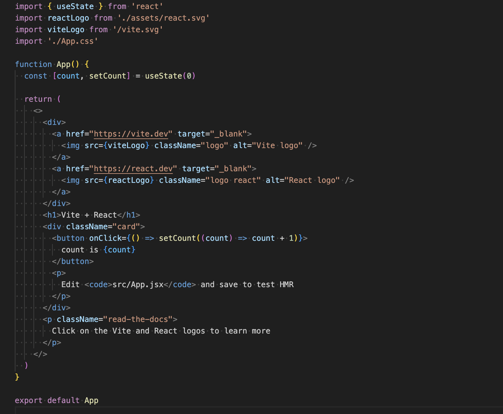
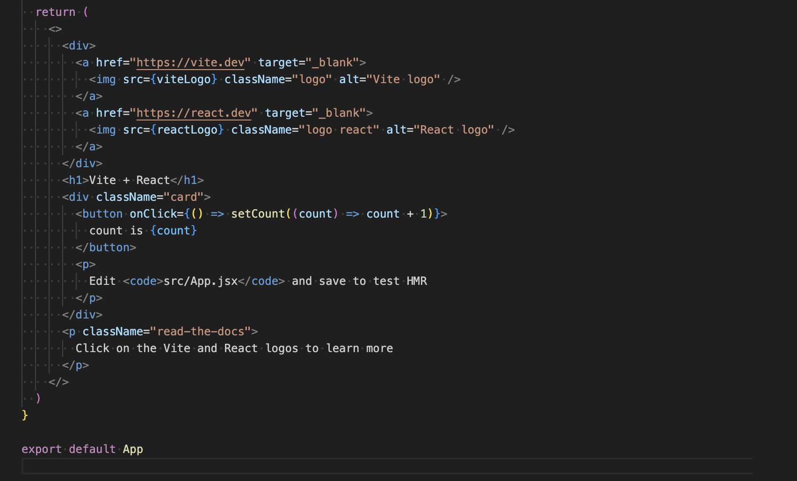
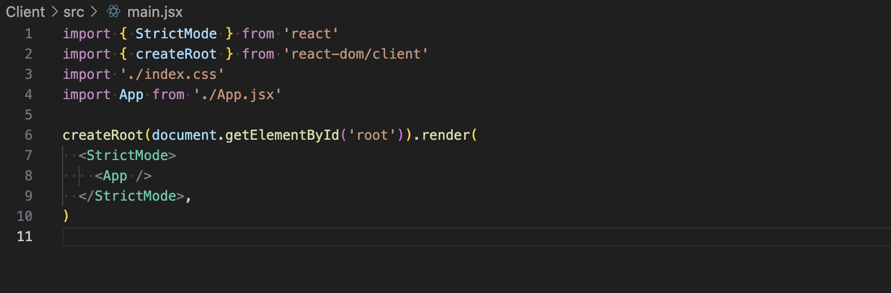

# Client3 - App.jsx


This code is part of the React component and is broken down line by line for better clarity below .

    import { useState } from 'react'

This code imports the <b>useState</b> hook from React. The <b>useState</b> is a function that allows you to add state to your functional components. In React, state refers to variables that are used to store information like user input and button status that does change over time. When calling useState you can get two things;
- current state - (like count)
- update state - setCount which is a function that you can use to update the state.

    ```import reactLogo from './assets/react.svg'```

This code imports React logo from a file named react.svg located in the assets folder inside the project. This logo is used in the components JSX with HTML like code.

        import viteLogo from '/vite.svg'
This also imports the Vite logo, similar to the React logo also found in the assets folder inside the project.


    import './App.css'

This code line imports the CSS styles folder for the component. App.css is a file where you can define custom styles that apply specifically to this component. It is a way of keeping your component styles organised in separate files which can be applied to elements within the component.


### App Component Function
    function App() {


This functional component is React allows you to create components as functions that return JSX (JavaScript SML) code. I looks very similar to HTML but allows JavaScript code and logic to be embedded inside. The APP component is the default component of the app and is the first one that is displayed when the app first loads.

      const [count, setCount] = useState(0)

This code is used for the useState hook to declare a state variable. The <b>count</b> is a variable that stores the state. The <b>setCount</b> is a function that lets you update the state (by modifiying the value of count). The <b>0</b> inside <b>useState</b> is the initial value of count (default). This means when the app first loads the count starts at 0.

## JSX



### Logo Links 

    <div>
        <a href="https://vite.dev" target="_blank">
          
        </a>
        <a href="https://react.dev" target="_blank">
          
        </a>
      </div>

- the <b>div</b> acts as a container for the two logos, making it easier to organise them together.
- the <b>href</b> attribute defines the URL that the link will navigate to when clicked.
- the <b>className="logo"</b> applies to a CSS class image the .logo class is defined in the App.css styling.
- the <b>alt="Vite logo"</b> This supplies an alternative text that is displayed if the image cannot load.
- the <b>h1</b> Is the simple heading element.
- the <b>clasName="card">---<></b>  is a styled container.
- the <b>button onClick()</b> this will trigger an event once the button is clicked, the event triggers a function that updates the state. setCount is called with an updated value: <b>count + 1</b>.
- <b>count is {count}</b> This is a dynamic expression that displays the current value of the count state. It will display "count is 0" and when the button is clicked count will update and the button will show the updated value.
- <b>p</b> This element provides a message to the user.

## Main.jsx



This code is the entry point of the React application, which is responsible for rendering the main APP component to the DOM

    import {StrictMode} from 'react'

This code imports the StrictMode component from React, it is a tool for highlighting potential problems in an application. It doesn't render anything visible in the UI but it helps identify issues with your app, for example;
- detecting unsafe lifecycles.
- warning about deprecated API's.
- ensuring that your code is ready for future React features.

        import { createRoot } from 'react-dom/client'

This code imports createRoot from the react-dom/client package, the ReactDOM.render() method was used to render a React component. The preferred method is to use createRoot() which enables better concurrency and improved performance.

    import './index.css'

This imports the global CSS file for the app (index.css). This file typically contains base styles for the entire application (eg. resetting default browser styles, setting font styles etc).

    import App from './App.jsx'

This line of code imports the APP component from the App.jsx file and contains the main component that wil be rendering inside the root DOM element.

    createRoot(document.getElementById('root')).render(
    <StrictMode>
    <App />
    </StrictMode>,
    )

Rendering the App component - this grabs the DOM element with the id-"root". In most React apps there is an HTML file like index.html that contains a <b>div id=root element</b>. This is where React will inject and render the app. This code creates a root React container on the DOM element with the id="root" for you to use this container to manage and render the component tree.

<b>render()</b> method is used to render a React component into the DOM, the code inside render() will be the actual UI that React will display inside the root container.

<b>StrictMode</b> is a component that wraps your entire app to help identify potential issues in the development. This doesn't affect production builds, but in development, React will perform additional checks and display warnings if any issues are found. The StrictMode here is wrapping the <App /> component, meaning all components inside APP and their descendants will be checked for issues. The <App /> component is the main component of your app. It's React component that you want to render in the DOM and it could contain other child components and defines the core logic and layout of the application.

This code is responsible for initialising and rendering the React application, it creates the root container in the DOM, and the App component is rendered inside a StrictMode wrapper to help catch development issues.
