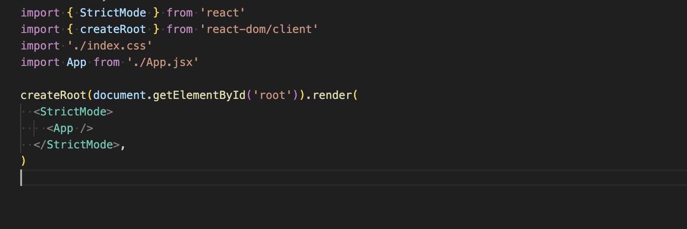

## Client5 App.js Index.js files

### Main.jsx File

This code is the commencement point for the React application. It's found in the index.js file and  sets up and renders the main App component to the web page. It uses React 18's createRoot API and includes StrictMode for development time checks. Additionally global CSS is applied from the imported index.css file.

Firstly you import StrictMode as a wrapper component from React that helps with detecting and identifying potential problems, it helps to highligh unsafe lifecycle methods and dprecated APIls as well as flagging other issues inside the application during development that may affect your app's performance or behaviour, and it doesn't affect the production build. 

The createRoot is imported to be used to create a root for rendering the application as part of the React's new API. It is utilised to connect it to the DOM and it is efficient in handling updates especially for features like concurrent rendering.

The <b>./index.css</b> will import the CSS file that contains the global styles to be applied to the application. These styles get applied to the entire app and can be added to or modified here to make your app look and feel the way you want.

<b>App</b> imports the main App component form the React App which is the root component of the application. It contains the main structure and logic and is where you would manage routing, global-state and components. This also gets rendered inside the root DOM and i can contain other child components that make up the build of the UI.

    createRoot(document.getElementById('root')).render(
     <StrictMode>
    <App />
    </StrictMode>,
    )
This code is rendering the APP, it finds teh HTML element and selects the DOM element with the ID of root, this is where the entire React app will be rendered in the HTML file (index.html). Then <b>.render</b> will render the provided JSX (StrictMode) component wrapping the App component inside the root DOM Element. The App component, once wrapped with StrictMode is now enabled for additional checks and warnings in development mode.

<b> App / </b> is where you define the structure and behaviour of your application.You can include multiple components such as;

- buttons
- forms
- sidebars
- navigation bars

By wrapping your APP in StrictMode React checks for issues, and deprecated methods that may have potential issues and helps you ensure your code is correct and modern. 

We are using React 18 as it has concurrent rendering which makes React apps faster and allowing you to work on multiple tasks at once. The createRoot method is part of these new features, and is more efficient that ReactDom.render().

### App.jsx File

Is a simple React component that is created using the build tool Vite, it defines a functional component App which uses React hooks, handles state with useStat and renders the content to the screen.

#### Import Statements

    import { useState } from 'react'
    import reactLogo from './assets/react.svg'
    import viteLogo from '/vite.svg'
    import './App.css'

- <b>import { useState } from 'react'</b> - imports the <b>useState</b> hook from React and is used to create state variables in functional components. It allows you to add state to your component withouth needing a class component.
- <b>import reactLogo from './assets/react.svg'</b> - imports React logo image
- <b>import viteLogo from '/vite.svg'</b> - imports Vite logo image
- <b>import './App.css'</b> - This code imports the CSS style file, all styles defined in the App.css will apply to this components HTML elements.

#### App Function

    function App() {
      const [count, setCount] = useState(0);

This function defines the component named App. A simpler and more concise way to name components and preferred over class components. The use of useState hook to create a piece of state called <b>count</b> with an initial value of <b>0</b>. count is the state variable that will hold the current value of the count. <b>setCount</b> is the function that allows you to update the count state whenever you call setCount, React will re-render the component with the updated value of count.

#### Exporting the Component

    export default App

This makes the App component available for use in other parts of the application by using export default you are allowing this component to be imported into other files.