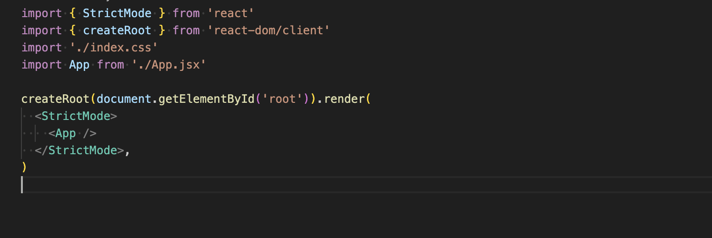

This code is the entry point for the React application. It sets up and renders the main App component to the web page. It sues React 18's createRoot API and includes StrictMode for development time checks. Additionally global CSS is applied from the imported index.css file.

Firstly you import StrincMode as a wrapper component from React that helps with detecting potential problems inside the application during development like unsafe lifecycle methods. It doesn't affect the production build. 

The createRoot is imported to be used to create a root for rendering the application as part of the React's new API. 

The ./index.css will import the CSS file for global styles to be applied to the application.

App imports the main App component form the file App.jsx whic is the root component of the application.

    createRoot(document.getElementById('root')).render(
     <StrictMode>
    <App />
    </StrictMode>,
    )
This code is rendering the APP it selects the DOM element with the ID of root, this is where the entire React app will be rendered in the HTML file (index.html). Then .render will render the provided JSX (StrictMode) component wrapping the App component inside the root DOM Element. The App component once wrapped with StrictMode it is now enabled for addistional checks and warnings in development mode.

