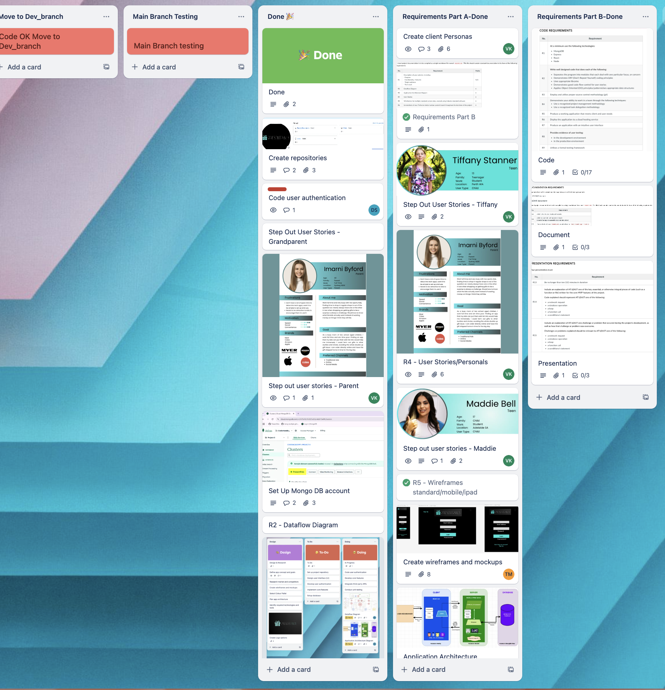
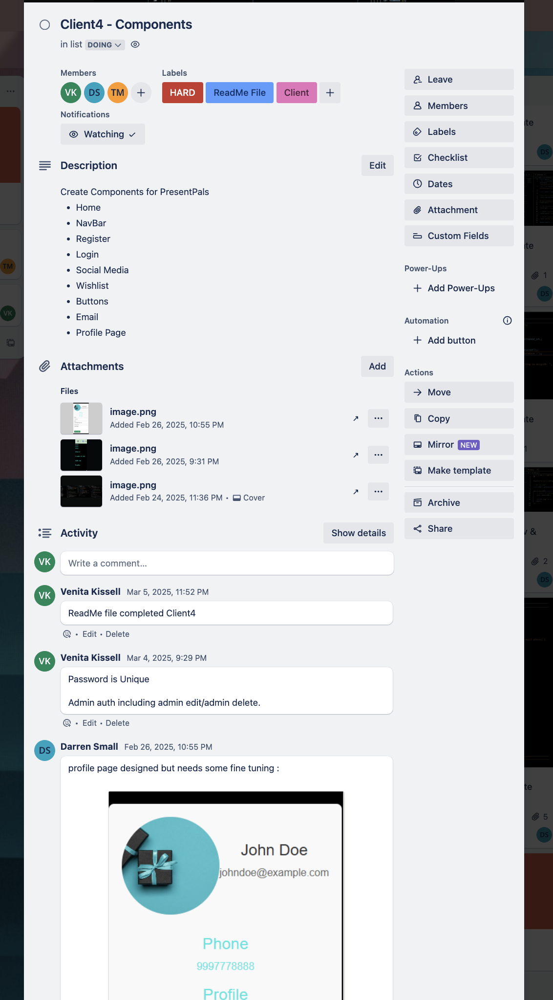

# Part B - PresentPals Gift List Application

<b>Developed by Darren Small, Tania Magro , and Venita Kissell</b>

# PresentPals Application Is Deployed Live & Available To Access/Use Via This URL:

# [PresentPals App](https://presentpals.netlify.app/)

## Repositories

## Frontend Installation Instructions for running on localhost
1.  Clone the Frontend Repository:

Use the following command to clone the repository;

    git clone git@github.com:PresentPals/Client.git

2.  Install the Dependencies;

Go to the project directory and install the required npm dependencies;

    npm install

3.  Start the Application;

Use this command to start the application running;

    npm start

4.  Access the Application;

    Open your browser and go to localhost:5173/

5.  Verify your backend Server is running;

    Ensure the backend server is running on a port number using the instructions provided below, before trying to signup or login.

6. Please Follow the PresentPals Application Instructions below for acces and use.

## Backend Installation Instructions for running on localhost

1.   Clone the Backend Repository:

Use the following command to clone the repository;

    git clone git@github.com:PresentPals/server.git

2. Create a .env File;

In the root directory of the project, create a .env file and add the following configuration for access to your own mongodb database setup:

    PORT=5001
    DATABASE_URL="YOUR MONGDB CLUSTER ACCESS URL HERE"
    JWT_SECRET="YOUR OWN JWT SECRET KEY HERE"

3.  Start MongoDB (WSL Users);

If you are using Windows Subsystem for Linux (WSL), start MongoDB with:

    sudo service mongod start

4.  Start the Server:

Install the packages needed for the app

    npm install

Use the following command to start the server:

    npm start

The server should indicate it is running on a port number.

## PresentPals Application Instructions For Use:

To login and test our app with a full range of stored data use the login and password below;

### login (admin): darrens 
### password: 12345678

1. Home: Go to the Presentpals App Home page & select the Sign Up option:

    [Home_page](https://presentpals.netlify.app/)

    

2. Sign Up: On the sign up page register your details:

    Note: the first person to register an email address will by default become the family/friends group administrator.

    

3. Log In: Go to the login page & login to the application, using your username & password.

    

4. Profiles: Once logged in, this lands you on the Profiles page.

    Note: only Admin users can add new profiles.

    

    - Select the 'Add New Profile' button to add your family or friend group members.
    - Select your own profile to edit / add more details.

    4a - Add Profile: Add your family / friend members. Must identify each member as a child (by default selection is Yes) or as an adult (select No). Every member MUST have a User Name.
        
    

NOW ALL MEMBERS CAN ACCESS / LOGIN TO THE APPLICATION USING THERE USER NAME & PASSWORD (assigned by the admin user.).

    Note: Access:

        - Adult members can: edit profiles,  

## Trello Board

[Trello_Board](https://trello.com/b/9SJfdpYQ/presentpals-app-t3-a2fullstack-app)

Here is the Link or our Trello board

## Client Libraries & Dependencies

### Front End

<b>axios (1.7.9)</b> : Is a popular JavaScript library used for making HTTP requests in web applications. It simplifies making API requests and handling responses. Promise based operations, browser and Node.js support it works both in the browser and Node.js environments adding to its versatility. It parses responses to JSON and allows you to modify requests globally before they are handled.

<b>bootstrap (5.3.3)</b> : Is a open source front end framework for building responsive web applications. It provides a library of pre-set designed components and styles that assist developers create sleek styles and modern UI's quickly. It's popular because it supports HTML, CSS and JavaScript.

<b>react(19.0.0)</b> : The new React 19.0.0 was released on December 2024 and had a major update with several signification features and improvements enhanced. It simplifies State with asynchronous functions to handle state transitions, enhances server side rendering capabilities, improves context API making it more efficient and easier to manage global state components, and loads more new features and improvements.

<b>react-dom (19.0.0)</b> : This is the latest version of React DOM library which is part of the React ecosystem. It's responsible for rendering React components to the Document Object Model in the browser, it handles the interaction between the web page and the components in React.

<b>react-router-dom (7.2.0)</b> : This facilitates routing and navigation, it lets you create dynamic page applications with client side routing capabilities.

<b>vite (6.1.0)</b> : Is a fast build tool for front end development. It focuses on providing an extremly fast development experience and optimising build process to make development and production builds quicker.

<b>vitejs/plugin-react (4.3.4)</b> : This package is a plug in specifically designed for Vite to provde support for React applications. It enables JSX syntax and other optimisations.

<b>globals (15.14.0)</b> : This refers to a library that provides global variables definitions for different JavaScript environments. It correctly identifies and manages global variables depending on the environment which your code is running ie Node.js or JavaScript.

### Backend

<b>bcrypt.js:</b> Used for safely storing user passwords by hashing them before storing them in the database. It provides a method to verify hashed passwords against plain text inputs, and enhances the application security by ensuring secure user authentication.

<b>cors:</b> Controls and manages access to resources from different domains. It allows and restricts requests from external origins, and ensures that only authorised domains can interact with the API, thus preventing unauthorised access while enabling legitimate cross-origin requests.

<b>dotenv:</b> Helps securely manage environment variables by loading configurations from a .env file into process.env. This keeps sensitive information like API keys and database credentials out of the source code, improving security and making it easier to manage different environments (development, testing, production).

<b>express:</b> A web framework used to build server-side logic and manage HTTP requests and responses. It provides robust features for routing, middleware support, and integration with various templating engines, simplifying the definition of routes and processing of requests.

<b>jsonwebtoken:</b> Commonly use for secure authentication by generating a token that encodes user information (e.g., user ID) using a secret key. This token is sent to the client and used for authenticating subsequent requests, ensuring secure access by verifying the token's authenticity.

<b>mongoose:</b> An Object Data Modeling (ODM) library for interacting with MongoDB. It offers a schema-based solution to model application data, allowing easy creation, reading, updating, and deletion of database records. Mongoose also provides data validation, middleware support, and complex querying capabilities.

<b>nodemon:</b> Is a utility that is a development tool that helps Node.js applications, it automatically monitors project files for changes and restarts the server when code changes are detected. This ensures that the application reflects the latest updates without needing manual server restarts.

<b>jest:</b> A testing framework designed to ensure code reliability and correctness. It offers a suite of utilities for writing unit and integration tests, verifying that the application functions as expected.

### Testing
<b>Front-end Testing</b>
Front-end testing was carried out through various stages to ensure our application met the quality standards and behaved as intended across various environments.

<b>Local Development Testing</b>
Each of the features were developed locally and systematically tested in a local development environment. This initial testing phase involved testing the functionality of individual functions, components, and pages.

<b>Public Development Testing</b>

##### [Development_Testing](https://drive.google.com/drive/folders/1IpM6sXtMSiIWg64UyHET883717-cXl6j)

Once the features were establised in the local environment, they were pushed to a development branch. Here, our testing was carried out using a public development database to simulate real-world usage and ensure compatibility with production settings. This phase also included testing on different devices and screen sizes, such as iphones, tablets and desktops to ensure the application’s accessibility and responsiveness.

<b>Production User Testing</b>

##### [Production Testing](https://drive.google.com/drive/folders/1R8Xd7JTp6mlCt9qE5Ao-eq-l9-vCBlic)

Features were then tested in a staging environment that closely mirrored the production setup. This phase involved gathering feedback from real users to validate the usability and functionality of the application in a near-production environment.

Results from user testing, including feedback and observations related to the login and sign-up workflows. Additionally, a screenshot capturing further notes from the user testing is also provided.

For additional context and visualization, screenshots of the testing processes and results are provided below, including commits and pushes to the dev branch.

## Project Management Methodology

Trello Board

##### [Trello_Board-PresentPals](https://trello.com/b/9SJfdpYQ/presentpals-app-t3-a2fullstack-app)

Trello Board Implementation for Streamlined Project Management
**Trello Board Implementation for Streamlined Project Management**

To enhance our project planning and execution, we strategically adopted Trello as our project management tool, leveraging its flexibility and the Kanban methodology to streamline our workflow. The Kanban approach, known for its visual task management system, allowed us to maintain a continuous flow of work while effectively minimising bottlenecks and disruptions throughout the project lifecycle.

By using Trello’s digital Kanban board, we ensured that every team member had a clear and transparent view of tasks at all times. This transparency was instrumental in prioritising tasks efficiently and holding team members accountable, as the status of each task was easily visible and up-to-date. The intuitive layout of Trello’s board empowered our team to make real-time adjustments and adapt swiftly to changes or unforeseen challenges, ensuring smooth progress throughout the project.

The flexibility of Trello enabled us to tailor the board to the specific needs of our project, allowing for a customized workflow that maximised efficiency and productivity. In addition, Trello’s automation features reduced the need for manual intervention, streamlining repetitive actions and significantly cutting down the time spent on administrative tasks. This setup was crucial in supporting continuous delivery, adhering to deadlines, and maintaining high standards of quality.

To ensure seamless execution, we carefully delegated tasks and responsibilities across our team, assigning roles based on individual expertise and project priorities. This clear distribution of tasks not only enhanced collaboration but also facilitated accountability, as each team member was fully aware of their responsibilities. By regularly tracking progress and adjusting priorities through Trello’s real-time updates, we maintained alignment and focus across the team, ensuring that every task moved forward efficiently.

Ultimately, the combination of the Kanban method with Trello’s adaptable digital platform created an organized, flexible, and highly effective task management system. This empowered our team to stay on track, maintain focus, and remain aligned, driving productivity from start to finish and ensuring the successful delivery of the project.

Our primary form of communication was via Discord, we created a dedicated server for the project for all related project discussions. We utilised the Lounge feature to discuss and test in real time

### Sprint 1

In Sprint 1 the tasks typically focus on setting up the foundation for the project, ensuring that the team had the necessary tools, access, and a clear understanding of the project’s objectives. This initial sprint included lots of planning, research, and preparation, as well as the first round of task implementation. The specific tasks varried depending on the project task.

### Sprint 2
In Sprint 2 we built on the foundation set from Sprint 1 and focused on the actual product set up and development, setting up the server and client repositories and starting the feature implementation, and refining processes. We continued the momentum from the initial planning and research phase while focusing more on executing deliverables, iterating on designs, and addressing immediate issues identified during Sprint 1.

### Sprint 3
Sprint 3 was focused on refining the product, making sure everything was working and fine tuning the way the app was utilised, so we had to make changes and enhance the features to suit, and ensuring that the initial functionalities from previous sprints are fully integrated and working as expected. We have a solid foundation and aimed to continue developing the product while testing, iterating, and fine-tuning. 

You will notice inside the Trello board that each card is marked for varying difficulties

    Level of difficulty
    - Red           HARD
    - Purple        Medium
    - Orange        easy

    Task type
    - Green         Server
    - Pink          Client
    - Blue          ReadMe File

    Members
    Each member has their own colour

This colour coded system allowed us to see at a glance the stages of the tasks, ensuring everything was transparent to every member.

## Discord Server

We established a Discord server to facilitate streamlined communication and enhance our collaboration accross our team. To improve efficiency we leveraged the lounge feature and utilised screen sharing enabling us to visualise and discuss changes in real time, as well as carry out testing.

## Testing

Extensive testing was carried out in a manual format