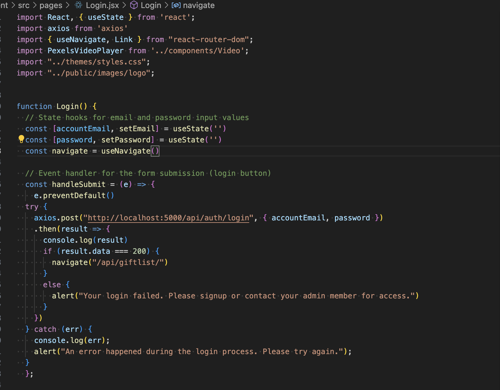
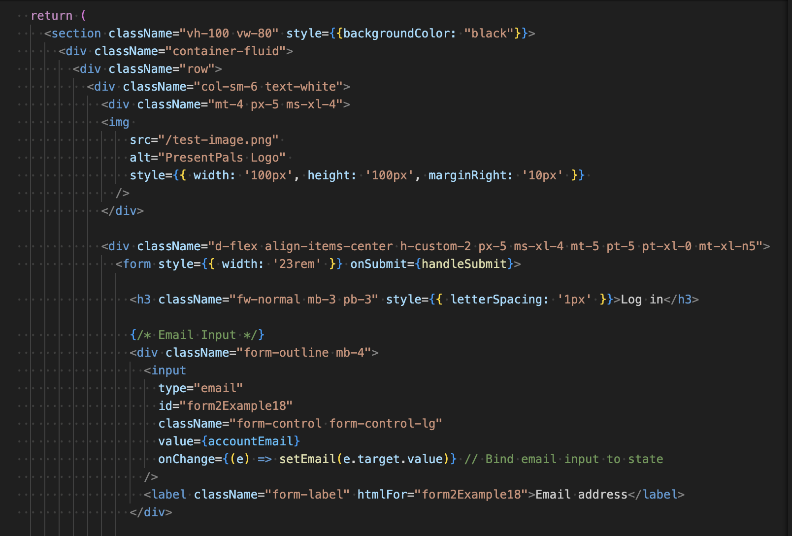
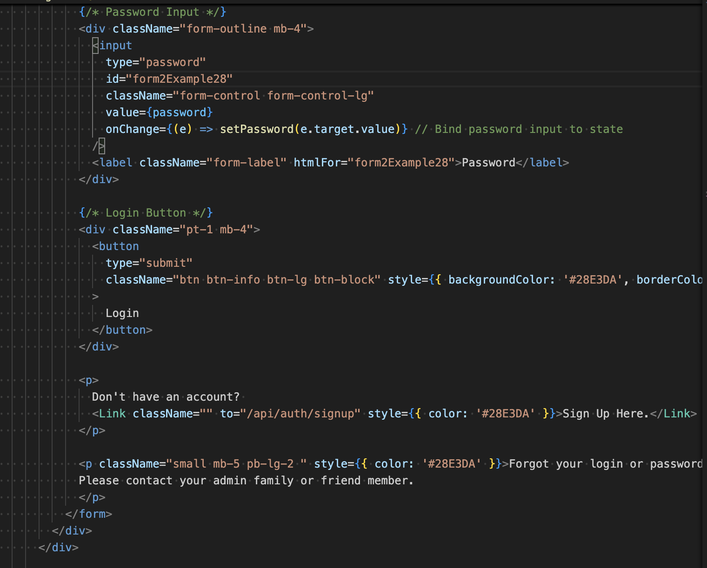
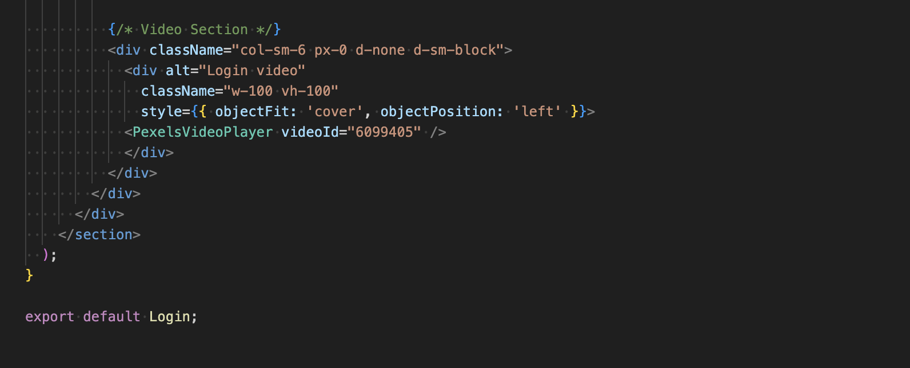
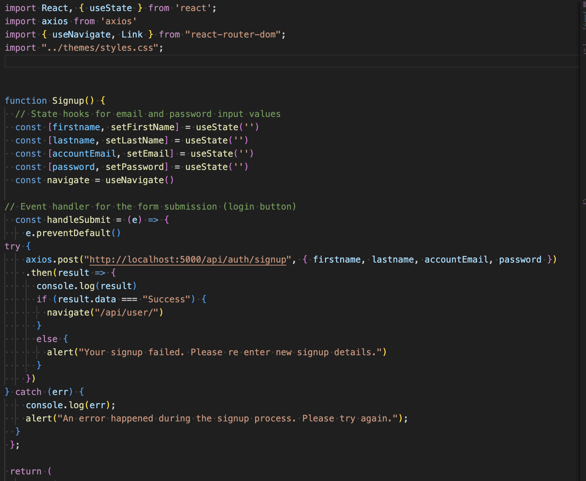

# React + Vite

## Login Page

The code below imports various dependencies that are needed to build a React bassed application. Further explanations are broken down for better clarity.

This line of code imports React and a specific hook called <b>useState</b> from the React Library.

    import React, { useState } from 'react';

 React is a popular JavaScript library for building user interfaces, typically for single page applications. <b>useState</b> is a React Hook used to manage state in a functional component, and it allows you to add state variables and modify them within a component.

    import axios from 'axios'

This line of code imports axios library which is a promise based HTTP client for the browser and Node.js. It is commonly used to make HTTP requests such as GET, POST, PUT DELETE to interact with the API.

    import { useNavigate, Link } from "react-router-dom";

This line of code imports two components from the react-router-dom library. <b>useNavigate</b> this hook is used to programmatically navigate to different routes in a React app. <b>Link</b> is a component that is used to create navigation links that allow you to navigate between different view sor pages withing a React app without refreshing the page.

    import PexelsVideoPlayer from '../components/Video';

This code snippet imports a custom component called<b>PexelsVideoPlayer</b> it handles displaying a video player, possibly integrated with Pexels a website for free stock photos and videos.

    import "../themes/styles.css";

This imports a CSS file located in ../themes/styles.css. This file contains custom styes relevant for the app to modify how the components look and behave.

    import "../public/images/logo";

This code imports and image of the logo from the specified path ../public/images/logo. This is used to display the logo in the app.

    function Login() {
    // State hooks for email and password input values
    const [accountEmail, setEmail] = useState('')
    const [password, setPassword] = useState('')
    

This code block is defining the React functinal component name Login(). It used for rendering the login form in the application. Two state variables for accountEmail and password. These states hold the input value by starting with an empty string ( '' ). Then the functions of setEmail and setPassword will be used to input the value from the login form and will update the value.

<b>useState</b> is a standard way of managing input values and handling state in functional components in React.

    const navigate = useNavigate()

This <b>useNavigate</b> hook is imported from react-router-dom and is used to programmatically navigate to different routes inside the app. It returns a navigate function that allows you to perform navigation actions like redirecting the user to a different page like redirecting to a dashboard or about you page after a successful login.

   
    const handleSubmit = (e) => {
        e.preventDefault()

The <b>handleSubmit</b> is an event handler that gets triggered when the form is submitted generally by clicking the login button.

<b>e.preventDefault()</b> This prevents the default form submission behaviour which is normally to reload the page. In React, it is common to prevent the default behaviour so you canhandle the form submission with JavaScript instead of refreshing the page.

  try {
    axios.post("http://localhost:5000/api/auth/login", { accountEmail, password })
    .then(result => {
      console.log(result)
      if (result.data === 200) {
        navigate("/api/giftlist/")
      }
      else {
        alert("Your login failed. Please signup or contact your admin member for access.")
      }
    })

The <b>axios.post()</b> is making an HTTP POST request to the backend API local host: 5000 with the email and password in the request body. This is sending the login credentials to the server that will authenticate the user.
- accountEmail and password are coming from the state, which are updated by the user as they type their credentials into the form fields.
- <b>.then(result => {...})</b> method is used to handle the response once the POST request completes. It takes a result parameter which is the response form the server.
- <b>console.log(result)</b> Will print the response from the server on the console so you can inspect it.
- <b>if (result.data === 200) This code checks if the response from the server has a data value of 200. This checks for a successful status code of HTTP 200.
- <b>navigate("/api/giftlist/")</b> If the login is successful (status code 200) the user is then redirected to the gift list page using navigate. This will be a page where the user can view their gift lists.
- <b>else</b> If the response is not a successful login, the result is sent to the client that the login has failed. The user will be alerted with a message to either sign up or contact admin.

  } catch (err) {
    console.log(err);
    alert("An error happened during the login process. Please try again.");

This <b>catch (err)</b> catch block catches any errors thrown withing the try block. If an error occurs like a network error or server error, or an unexpected error, it will jump into this catch block. The error object gets passed when something goes wrong. It contains information about the error like a message/status or other properties of the error type.

- <b>console.log(err)</b> This logs the error object to the console. Logging the error helps to debug and inspect the issue when something goes wrong. It will show details about the error (like network errors and other unexpected issues) in the browsers console.

- <b>alert</b> This displays a pop up alert to the user alerting them of the error with the login process. The alert informs the user that a problem occured during the login process and suggest that they try again.

## Signup Form

This component is responsible for rendering a signup form and handling the form submission, where the user an input their personal details to create an account. It includes the use of React hooks, Axios for API requests and React Router for Navigation.

- <b>useState</b> This React hookis imported to help mange the state of the form input values eg first name, last name, email, password.
- <b>axios</b> is a library that is used to make HTTP requests, in this signup form it is being used to send a POST request to the backend when the user submits the form.
- <b>useNavigate</b> hook from react-router-dom is used to navigate programmatically between routes to redirect the users after a successful signup.
- <b>Link</b> is used to create links to other pages.
- <b>../themes/styles.css</b> This imports a CSS file that is used to style the component.

    function Signup() {
    
      const [firstname, setFirstName] = useState('')
      const [lastname, setLastName] = useState('')
      const [accountEmail, setEmail] = useState('')
      const [password, setPassword] = useState('')
      const navigate = useNavigate()

The state variables declared above represent the values the user enters into the input fields in the signup form. The "Set" functions are used to update these state variables. The navigate function provided by the useNavigate hook is used to navigate to another page once the signup is successful.

     const handleSubmit = (e) => {
       e.preventDefault()
       try {
         axios.post("http://localhost:5000/api/auth/signup", { firstname, lastname, accountEmail, password })
         .then(result => {
           console.log(result)
           if (result.data === "Success") {
            navigate("/api/user/")
       }
       else {
         alert("Your signup failed. Please re enter new signup details.")
       }
         })
    } catch (err) {
        console.log(err);
        alert("An error happened during the signup process. Please try again.");
      }
     };

- <b>e.preventDefault()</b> This prevents the default form submission behaviour which would typically reload the page.
- <b>axios.post(...)</b> This sends a POST request to the bakend API the local hos:5000 with the firstname, lastname, accountEmail and password as the request body. The backend should handle the data created by the user in the database and respond with a result like success or failure.
- <b>.then(result => {...})</b> performs after the POST request completes the result is checked. If <b>result.data === "Success"</b> it means the signup was successful and the user is redirected to the /api/user page. If the result is not "Success" then an alert is shown to the user indicating that the signup failed, and they should re-enter their details.
- <b>Catch (err)</b> If ther is an error like the API request fails, the error is logged to the console and an alert is shown to the user notifying them to try again.

This template provides a minimal setup to get React working in Vite with HMR and some ESLint rules.

Currently, two official plugins are available:

- [@vitejs/plugin-react](https://github.com/vitejs/vite-plugin-react/blob/main/packages/plugin-react/README.md) uses [Babel](https://babeljs.io/) for Fast Refresh
- [@vitejs/plugin-react-swc](https://github.com/vitejs/vite-plugin-react-swc) uses [SWC](https://swc.rs/) for Fast Refresh
